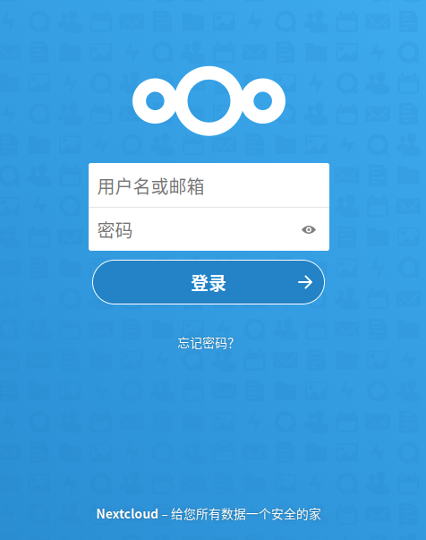
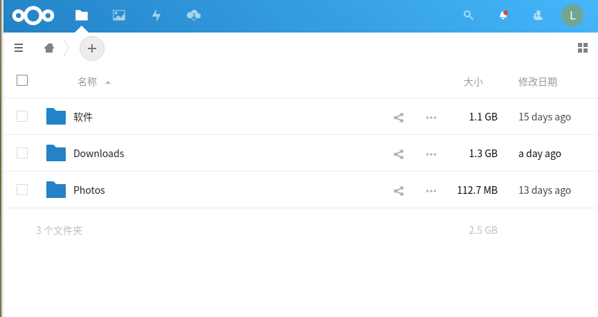
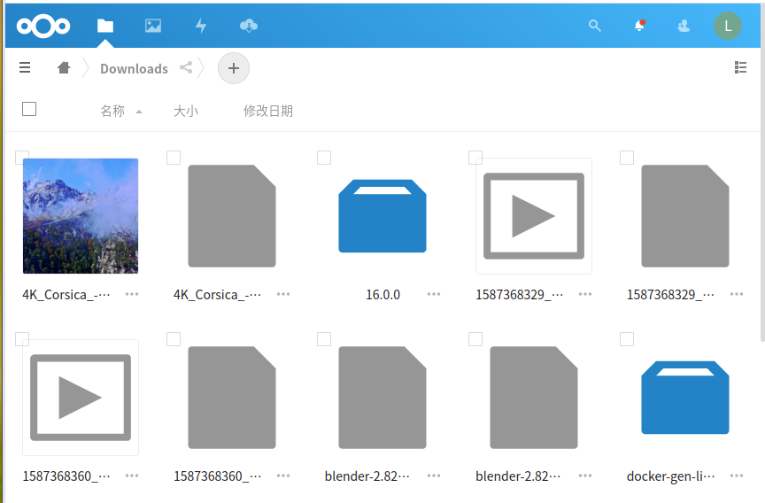
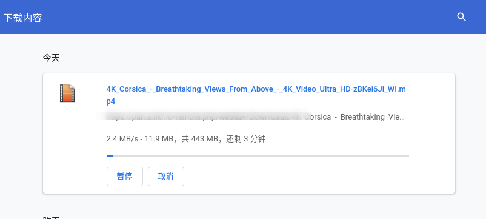
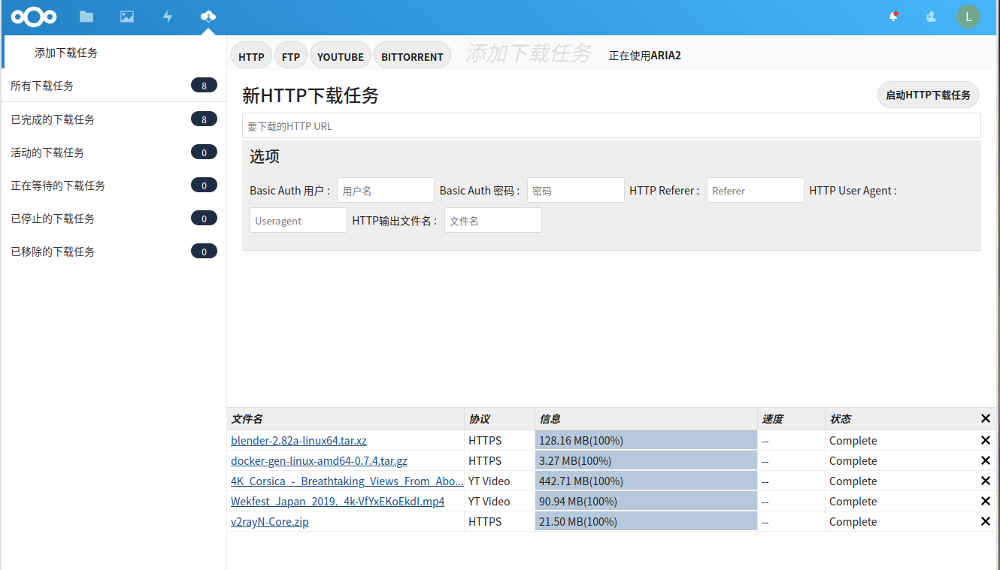
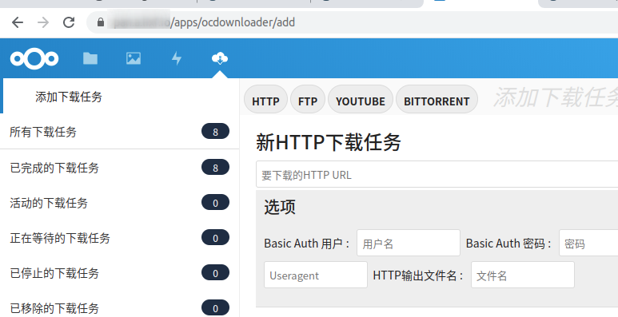
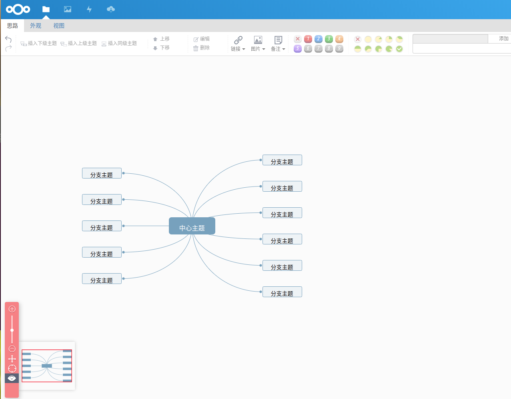
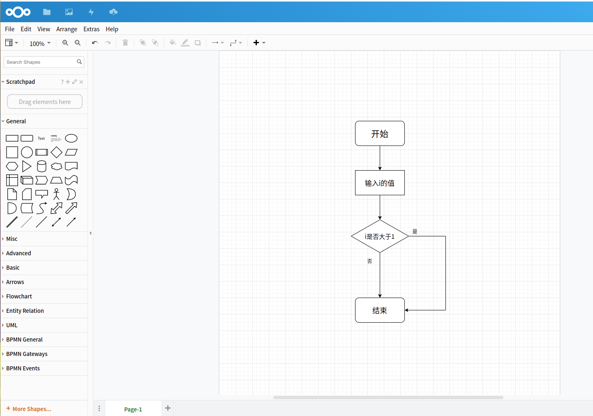

[NextCloud](https://nextcloud.com/)是老外开源的一个用PHP开发的有丰富插件的网盘，针对各个平台（安卓、ios、linux、mac、win）都有对应的客户端，功能十分强大。


### 预览

#### 登录




#### 主页




#### 文件列表




#### 下载 

下载速度因个人网络不同而不同。我这里是因为电信的上传带宽只有30M，因此在公网的速度只能达到每秒2兆多。如果在内网访问，速度能达到每秒近百兆




### Docker部署

部署的文档[官网](https://hub.docker.com/_/nextcloud)写的很详细了，最简单可以用下面一条命令就可以启动。当然实际使用要做各种配置(录例如数据库、存储)，可以去看[官网](https://hub.docker.com/_/nextcloud)说明，这里就不再详说了

```bash
docker run -d -p 8080:80 nextcloud
```


### 离线下载

这个是一个重点要宣传的功能，其作用与百度网盘的离线下载一样，可以将指定链接下载到自己的服务器上。

离线下载并不是nextcloud自带的功能（实际上nextcloud大部分的功能都是通过插件实现），而是借助一个叫做ocDownloader的插件实现。用管理员账户点击主页右上角的头像，在下拉菜单中选择【应用】，然后搜索ocDownloader安装即可。由于国内访问nextcloud自己的网站很慢，因此这里耐心等待一会。实在下载不下来的，可以找个能科学上网的机器，直接访问[插件主页](https://apps.nextcloud.com/apps/ocdownloader)下载安装包，然后解压到nextcloud的/var/www/html/custom_apps目录下，然后在应用页面启用该插件。


效果如图:




从图中可以看出，离线下载功能支持HTTP、FTP、Bittorrent协议，以及支持YOUTUBE链接。不过在使用前需要安装Aria2（也可以用curl,但是aria2功能更强大）、以及youtube-dl(如果需要下载youtube视频)。

> 注意，要保证nextcloud对应的用户(nextcloud官方镜像中nextcloud对应的用户是www-data)对aria2有执行权限。

鉴于我们使用的是Docker部署，我这里封了一个安装好aria2和youtube-dl的Docker镜像【mrlee326/nextcloud-aria】，已经上传到dockerhub，可以下载安装使用。

下载youtube视频需要能够科学上网，如果nextcloud部署的宿主机网络环境不是很自由的话，可以在【设置】-> 【其它设置】-> 【ocDownloader】中配置一下代理。

如果有v2ray的服务器的话，可以使用【mrlee326/v2raycli】镜像在宿主机上启动一个容器来提供代理，并链接到nextcloud容器上来使用。

```
docker run -d --name proxy.com -p 7777:6666 -v /root/v2ray/config.json:/etc/v2ray/config.json:ro mrlee326/v2raycli
# 容器的名字本来是可以随便取的，但是如果不设置这种url形式的，后面在ocdownloader的配置中会出错
```

启动代理容器后，在启动nextcloud的时候加上 --link proxy.cn参数，例如

```bash
docker run -d --link proxy.com -p 8080:80 mrlee326/nextcloud-aria
```

然后在【其它设置】-> 【ocDownloader】中可以指定代理地址为 http://proxy.com ，端口是 7777

设置代理的作用不仅仅是为了下载youtube视频，用国内的网络直接访问外国的一些资源的时候，往往速度不是很理想，甚至可能必须配置代理才能使用。如果我们nextcloud的离线下载可以自由访问外网的话，就可以先利用离线下载功能将资源下载到我们的nextcloud里，再从nextcloud下载到我们本地，十分方便。


### HTTPS

我们也可以为我们的云盘启用HTTPS，感谢Docker容器，让这一切变的如此简单。这里主要使用两个容器，【jwilder/nginx-proxy】和【jrcs/letsencrypt-nginx-proxy-companion】。我们也可以用这两个容器为其它任意服务签发证书

虽然简单，我们还是要做一些准备工作。

1. 第一步当然是将域名解析到宿主机的公网IP上了，这里假设域名是pan.foo.bar

2. 由于nextcloud主要是为了下载上传一些文件，因此，必须调整nginx配置中的client_max_body_size参数为一个较大的值。jwilder/nginx-proxy提供了两种修改方式，全局的和指定某域名的。这里为了方便，我们直接配置全局的方式。

   在任意目录下创建一个my_proxy.conf文件（我这里是在/data/nginx/conf.d/目录下创建的），然后写入下面的内容。前三行是设置超时时间的，根据自己的需要进行设置。如果只想修改某域名的此项配置，[点击这里](https://github.com/nginx-proxy/nginx-proxy)参考官方文档进行配置。

```
proxy_connect_timeout 600;
proxy_send_timeout 600;
proxy_read_timeout 600;
client_max_body_size 10000m;
```


这样准备工作就做完了，下一步是启动jwilder/nginx-proxy容器

```bash
docker run --detach   \
--restart=always  --name nginx-proxy   \
--publish 80:80    \
--volume /usr/share/nginx/html    \
--volume /data/nginx/conf.d/my_proxy.conf:/etc/nginx/conf.d/my_proxy.conf:ro  \
--volume /var/run/docker.sock:/tmp/docker.sock:ro  \
jwilder/nginx-proxy
```


nginx-proxy容器启动完成后，用下面的命令启动letsencrypt-nginx-proxy-companion容器。将me@foo.bar换成自己的邮箱

```bash
 docker run --detach \
    --name nginx-proxy-letsencrypt \
    --volumes-from nginx-proxy \
    --volume /var/run/docker.sock:/var/run/docker.sock:ro \
    --env "DEFAULT_EMAIL=me@foo.bar" \
    jrcs/letsencrypt-nginx-proxy-companion
```


最后就可以启动nextcloud容器啦

```bash
docker run --detach \
    --name nextcloud \
    --restart always \
    --link proxy.com\
    --env "VIRTUAL_HOST=pan.foo.bar" \
    --env "VIRTUAL_PORT=3000" \
    --env "LETSENCRYPT_HOST=pan.foo.bar" \
    --env "LETSENCRYPT_EMAIL=me@foo.bar" \
    --v /data/nextcloud:/var/www/html \
     mrlee326/nextcloud-aria
```


启动完成稍等一下，letsencrypt-nginx-proxy-companion会自动为你签发证书，等证书签发完成后，就可以通过https://pan.foo.bar访问网盘了。如果直接输入pan.foo.bar，也会自动跳转到https://pan.foo.bar的。

值得注意的是，每次重新启动容器，letsencrypt-nginx-proxy-companion都会重新签发证书，可能一不小心就会超过letsencrypt的配额限制，这样的话，得等一周后才能释放配额。因此如果在配置阶段，可以先不加LETSENCRYPT的两个环境变量，避免自动签发证书，等调试好了，再加上这两个环境变量。

最终效果如图所示，在域名的左边出现了一个代表启用了https的小锁的标志。




### 必备的插件

nextcloud还有很多其它有用的插件，这里介绍两个十分有用的插件【Mind Map】和 【Draw.io】

#### Mind Map 

用来画思维导图，启用了这个插件以后，我们就可以直接创建思维导图，并进行绘制



#### Draw.io

用来画流程图，作用十分类似于国内的在线的ProcessOn。安装了Draw.io后，我们就可以将流程图文件保存在我们自己的服务器上，并且没有数量限制。不过，不像【Mind Map】，这个插件依赖外部的Drawio服务，我们可以选择自行部署，也可以选择直接使用公网的。如果使用公网的Drawio，除了打开的时候速度慢一点，别的和自己搭建的效果是一模一样的。当然，drawio也有对应的docker镜像，就算自己部署，也是特别的容易。




### 其它

现在的云服务器的存储空间都不是很大，而且要不就是不支持增加存储，要不就是增加存储特别的贵。因此，我目前采用的是，将nextcloud部署到树莓派上，再购买一台搬瓦工GIA线路的服务器，然后通过内网穿透将服务暴露在公网上。这样，一方面解决了存储的问题，一方面在内网的时候可以直接通过内网访问nextcloud，最后公网服务器也可以做别的事情。
